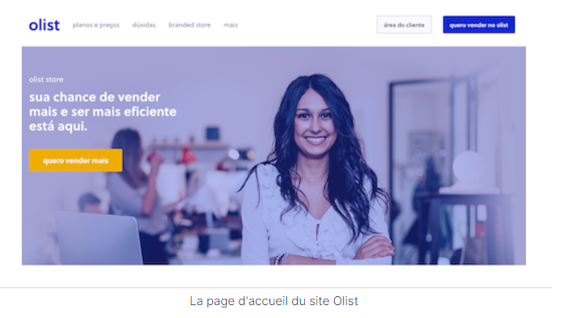

# Segment customers of an e-commerce site
You are a consultant for Olist, a Brazilian company that offers a sales solution on online marketplaces.

Olist wants you to provide its e-commerce teams with customer segmentation that they can use on a daily basis for their communication campaigns.

Your goal is to understand the different types of users through their behavior and personal data.

You will need to provide the marketing team with an actionable description of your segmentation and its underlying logic for optimal use, 
as well as a maintenance contract proposal based on an analysis of segment stability over time.
### Data
For this mission, Olist provides you with an anonymized database: https://www.kaggle.com/datasets/olistbr/brazilian-ecommerce 
containing information on order history, products purchased, satisfaction comments, and customer location since January 2017.
## Your mission 
 The goal is to help Olist teams understand the different types of users. You will therefore use unsupervised methods to group customers with similar profiles. 
These categories can be used by the Marketing team to better communicate

The proposed segmentation must be usable and easy to use by our Marketing team. It must at least be able to differentiate between good and less good customers in terms of orders and satisfaction. We are of course expecting segmentation on all customers.

Secondly, once the segmentation model has been chosen, we would like you to recommend how often the segmentation should be updated to remain relevant, in order to be able to quote a maintenance contract.

For information, the code provided must respect the PEP8 convention, to be usable by Olist
